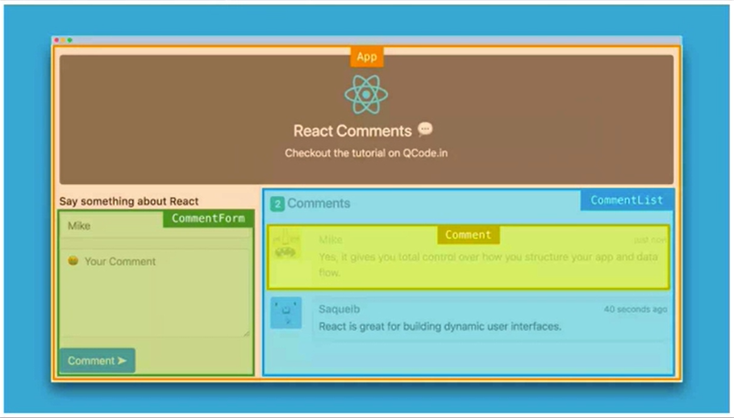
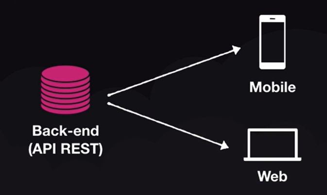
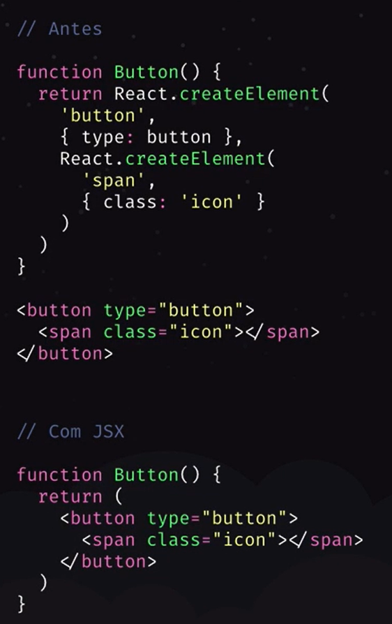

# Conceitos React

## O que é React?

- Biblioteca para construção de interfaces
- Utilizado para construção de Single-Page-Applications (SPA)
- É considerado uma biblioteca, porém ao analisar ao ecossistema React pode ser considerado um framework
- Tudo fica dentro do JavaScript
  - Incluindo HTML e CSS
- **React:** Biblioteca de construção de interfaces e componentização
- **ReactJS:** Comportamento do React no Browser (ReactDOM - Facebook)
- **React Native:** React para Mobile (Integração com bibliotecas nativas)

## Vantagens

- Organização do código
  - Componentização
    - Dividir partes da tela em pequenos componentes <br>
        
- Divisão de responsabilidade
  - Back-end: Regra de negócio
  - Front-end: Interface
- Uma API, múltiplos clientes <br>

- Programação declarativa

## JSX

- HTML dentro do JS (JavaScript + XML)
- Com React podemos criar nossos próprios elementos
    

## Imperativo VS Declarativo

- Na programação imperativa passamos todas as instruções e casos possíveis ao computador comparando com estado anterior
- Na programação declarativa apenas informamos que deve possuir um elemento com o numero atual, sendo o numero atual retornado do back-end, ou seja, o front-end preocupa-se em receber o valor atual e não no estado que possuia antes para montar ou não um componente


## Babel / Webpack

- O browser não entende todos esses códigos novos
- O **Babel** converte (transpila) o código JS de uma forma que o qualquer browser entenda
- O **Webpack**
  - Cria um bundle com todos os códigos da aplicação
  - Permite ao JS como importar CSS, imagens e etc.
  - Live reload com Webpack Dev Server
  
## Loaders

- Utilizado pelo webpack para carregar o código
  - babel-loader
    - Converter o JS em algo que o browser entenda
  - css-loader
    - Converter CSS em algo que o browser entenda
  - image-loader
  - ...

# Criando um projeto

```bash
yarn init -y
yarn add react react-dom #Instala a biblioteca React e ReactJS (Para Web)
yarn add @babel/core @babel/preset-env @babel/preset-react webpack webpack-cli #Instala os presets babel e o core do webpack
yarn add @babel/cli #Permite a execução do babel via cli
yarn add babel-loader #Loader do webpack para babel
yarn add webpack-dev-server #Fornece um servidor para desenvolvimento com Live Reload (Necessita ser configurado com os arquivos de configuração)
```

## Babel Presets

- @babel/preset-env 
  - Entende o ambiente em que está sendo executado e converte o JS para rodas naquele ambiente
- @babel/preset-react
  - Converte as funcionalidade do React para que o browser consiga entender
  ```js
  babel.config.js

  module.exports = {
      presets: [
          '@babel/preset-env',
          '@babel/preset-react'
      ],
  }
  ```

## Babel CLI

- Transpila de forma manual o código escrito em ES6 para permitir ser lido em qualquer browser
  ```bash
  yarn babel src/index.js --out-file public/bundle.js
  ```

## Webpack

- No arquivo de configuração do webpack (`webpack.config.js`) devemos informar o(s) arquivo(s) de entrada, de saída e as regras de carregamento
  - Utilizar sempre o módulo 'path' do Node para informar caminhos 
  - Nas regras devemos informar, através de expressões regulares, quais arquivos devem ser lidos por aquela regra.
    - Chave 'test'
  - Podemos informar quais arquivos não desejamos que sejam lidos
    - Chave 'exclude'
  - Por fim indicamos qual loader deve ser utilizado para carregar aqueles arquivos
    - Chave 'use'
    - Lembrando que os loaders devem ser instalados através do NPM ou YARN
  ```js
  const path = require('path')

  module.exports = {
      entry: path.resolve(__dirname, 'src', 'index.js'),
      output: {
          path: path.resolve(__dirname, 'public'),
          filename: 'bundle.js'
      },
      module: {
          rules: [{
              test: /\.js$/,
              exclude: /node_modules/,
              use: {
                  loader: 'babel-loader'
              }
          }]
      }
  }
  ```
- Para executar o Webpack na mão, ou seja compilar os arquivos de entrada e criar seus respectivos outputs, basta rodar `yarn webpack --mode development`
- Para o desenvolvimento podemos fazer uso do módulo `webpack-dev-server` que nos fornece um live reload server que monitora e cria o bundle a medida que as alterações são realizadas no arquivo de entrada
  - Deve-se adicionar a chave `devServer` informando o como `contentBase` o diretório publico da aplicação
  - Para executar o servidor basta rodar `yarn webpack-dev-server --mode development`
  ```js
  const path = require('path')

  module.exports = {
      entry: path.resolve(__dirname, 'src', 'index.js'),
      output: {
          path: path.resolve(__dirname, 'public'),
          filename: 'bundle.js'
      },
      devServer: {
          contentBase: path.resolve(__dirname, 'public')
      },
      module: {
          rules: [{
              test: /\.js$/,
              exclude: /node_modules/,
              use: {
                  loader: 'babel-loader'
              }
          }]
      }
  }
  ```

## Boilerplates

- Toda a configuração acima realizada é realizada automaticamente com boilerplates como `create-react-app`

# Iniciando o Desenvolvimento

## Componentização

- Podemos fazer uso do React sem componentização, utilizando o método `render()`, com isso estamos fazendo uso de JSX, ou seja, inserindo HTML dentro do JS
  Inserimos o `Hello World` dentro da div#app
  ```js
  import React from 'react'
  import { render } from 'react-dom'

  render(<h1> Hello World </h1>, document.querySelector('#app'))
  ```
- A componentização nos facilita o desenvolvimento
  - Os arquivos de componentes devem ser iniciados com letra maiuscula
  - Devemos iniciar o código do componente importando o React
    - `import React from 'react'`
  - Possuir uma função que retorna o código HTML
    - `function App() { return <h1> Hello World </h1> }`
    - Atenção que o código HTML não está como String e sim como HTML (XML) direto
  - Por fim exportar a função
    - `export default App`