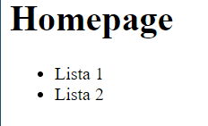

# Conceitos React

## O que é React?

- Biblioteca para construção de interfaces
- Utilizado para construção de Single-Page-Applications (SPA)
- É considerado uma biblioteca, porém ao analisar ao ecossistema React pode ser considerado um framework
- Tudo fica dentro do JavaScript
  - Incluindo HTML e CSS
- **React:** Biblioteca de construção de interfaces e componentização
- **ReactJS:** Comportamento do React no Browser (ReactDOM - Facebook)
- **React Native:** React para Mobile (Integração com bibliotecas nativas)

## Vantagens

- Organização do código
  - Componentização
    - Dividir partes da tela em pequenos componentes <br>
        
- Divisão de responsabilidade
  - Back-end: Regra de negócio
  - Front-end: Interface
- Uma API, múltiplos clientes <br>

- Programação declarativa

## JSX

- HTML dentro do JS (JavaScript + XML)
- Com React podemos criar nossos próprios elementos
    

## Imperativo VS Declarativo

- Na programação imperativa passamos todas as instruções e casos possíveis ao computador comparando com estado anterior
- Na programação declarativa apenas informamos que deve possuir um elemento com o numero atual, sendo o numero atual retornado do back-end, ou seja, o front-end preocupa-se em receber o valor atual e não no estado que possuia antes para montar ou não um componente


## Babel / Webpack

- O browser não entende todos esses códigos novos
- O **Babel** converte (transpila) o código JS de uma forma que o qualquer browser entenda
- O **Webpack**
  - Cria um bundle com todos os códigos da aplicação
  - Permite ao JS como importar CSS, imagens e etc.
  - Live reload com Webpack Dev Server
  
## Loaders

- Utilizado pelo webpack para carregar o código
  - babel-loader
    - Converter o JS em algo que o browser entenda
  - css-loader
    - Converter CSS em algo que o browser entenda
  - image-loader
  - ...

# Criando um projeto

```bash
yarn init -y
yarn add react react-dom #Instala a biblioteca React e ReactJS (Para Web)
yarn add @babel/core @babel/preset-env @babel/preset-react webpack webpack-cli #Instala os presets babel e o core do webpack
yarn add @babel/cli #Permite a execução do babel via cli
yarn add babel-loader #Loader do babel para webpack
yarn add webpack-dev-server #Fornece um servidor para desenvolvimento com Live Reload (Necessita ser configurado com os arquivos de configuração)
yarn add style-loader css-loader #Loader de CSS para webpack
yarn add file-loader #Permite o carregamento de arquivos dentro da aplicação
yarn add axios #Realiza as chamadas da API
```

## Babel Presets

- @babel/preset-env 
  - Entende o ambiente em que está sendo executado e converte o JS para rodas naquele ambiente
- @babel/preset-react
  - Converte as funcionalidade do React para que o browser consiga entender
  ```js
  babel.config.js

  module.exports = {
      presets: [
          '@babel/preset-env',
          '@babel/preset-react'
      ],
  }
  ```

## Babel CLI

- Transpila de forma manual o código escrito em ES6 para permitir ser lido em qualquer browser
  ```bash
  yarn babel src/index.js --out-file public/bundle.js
  ```

## Webpack

- No arquivo de configuração do webpack (`webpack.config.js`) devemos informar o(s) arquivo(s) de entrada, de saída e as regras de carregamento
  - Utilizar sempre o módulo 'path' do Node para informar caminhos 
  - Nas regras devemos informar, através de expressões regulares, quais arquivos devem ser lidos por aquela regra.
    - Chave 'test'
  - Podemos informar quais arquivos não desejamos que sejam lidos
    - Chave 'exclude'
  - Por fim indicamos qual loader deve ser utilizado para carregar aqueles arquivos
    - Chave 'use'
    - Lembrando que os loaders devem ser instalados através do NPM ou YARN
  ```js
  const path = require('path')

  module.exports = {
      entry: path.resolve(__dirname, 'src', 'index.js'),
      output: {
          path: path.resolve(__dirname, 'public'),
          filename: 'bundle.js'
      },
      module: {
          rules: [{
              test: /\.js$/,
              exclude: /node_modules/,
              use: {
                  loader: 'babel-loader'
              }
          }]
      }
  }
  ```
- Para executar o Webpack na mão, ou seja compilar os arquivos de entrada e criar seus respectivos outputs, basta rodar `yarn webpack --mode development`
- Para o desenvolvimento podemos fazer uso do módulo `webpack-dev-server` que nos fornece um live reload server que monitora e cria o bundle a medida que as alterações são realizadas no arquivo de entrada
  - Deve-se adicionar a chave `devServer` informando o como `contentBase` o diretório publico da aplicação
  - Para executar o servidor basta rodar `yarn webpack-dev-server --mode development`
  ```js
  const path = require('path')

  module.exports = {
      entry: path.resolve(__dirname, 'src', 'index.js'),
      output: {
          path: path.resolve(__dirname, 'public'),
          filename: 'bundle.js'
      },
      devServer: {
          contentBase: path.resolve(__dirname, 'public')
      },
      module: {
          rules: [{
              test: /\.js$/,
              exclude: /node_modules/,
              use: {
                  loader: 'babel-loader'
              }
          }]
      }
  }
  ```

## Boilerplates

- Toda a configuração acima realizada é realizada automaticamente com boilerplates como `create-react-app`

# Iniciando o Desenvolvimento

## Componentização

- Podemos fazer uso do React sem componentização, utilizando o método `render()`, com isso estamos fazendo uso de JSX, ou seja, inserindo HTML dentro do JS
  Inserimos o `Hello World` dentro da div#app
  ```js
  import React from 'react'
  import { render } from 'react-dom'

  render(<h1> Hello World </h1>, document.querySelector('#app'))
  ```
- A componentização nos facilita o desenvolvimento
  - Os arquivos de componentes devem ser iniciados com letra maiuscula
  - Devemos iniciar o código do componente importando o React
    - `import React from 'react'`
  - Possuir uma função que retorna o código HTML
    - `function App() { return <h1> Hello World </h1> }`
    - Atenção que o código HTML não está como String e sim como HTML (XML) direto
  - Por fim exportar a função
    - `export default App`
  - Caso seja um componente simples, podemos exportar diretamente a função
    - `export default function App() { return <h1> Olá mundo! </h1> }`
  - Caso o JSX sejá maior que uma linha necessitamos retornar entre parenteses 
- Os elementos JSX precisam retornar apenas um elemento, ou seja, caso seja necessário retornar mais de um elemento, precisamos colocá-los dentro de uma div e retornar apenas está div com seu conteúdo dentro
  - Errado:
      ```js
      return (
        <Header />
        <Header />
      )
      ```
  - Certo: 
      ```js
      return (
        <div>
            <Header />
            <Header />
        </div>
      )
      ```
  - Tal prática pode acabar causando problemas durante a estilização, portanto existe o conceito de 'fragment' que permite a inserção de uma tag HTML vazia que encapsula o conteúdo interno, porém ao renderizar não insere nenhuma tag nova
    - ```js
      return (
        <>
            <Header />
            <Header />
        </>
      )
      ```

## Propriedades

- Utilizado para passar informações/conteúdo de um componente pai para um componente filho 
  - Ex: Passar um titulo para dentro do componente `<Header />`
    - Para isso criamos um atributo com o nome desejado dentro deste componente e inserimos um valor para ele
      - `<Header atributo="valor" />`
    - No arquivo deste componente, a função receberá como primeiro parametro um objeto contendo todos os atributos/propriedades passadas na chamada do componente
      - Para utiliza-lo dentro do return apenas precisamos colocar a variavel entre chaves para que seja reconhecida como variavel
      ```js
      export default function Header(props) {
        return (
            <header>
                <h1> {props.atributo} </h1>
            </header>
        )

      >>> valor
      }
      ```
    - Podemos aplicar também desestruturação (destructuring) na função a fim de facilitar a manipulação dos valores
      ```js
        export default function Header({ atributo }) {
          return (
              <header>
                  <h1> { atributo } </h1>
              </header>
          )

        >>> valor
        }
      ```
- Todo o componente possui por padrão a propriedade `children` que recebe o HTML/JSX/conteúdo que está dentro do componente
    ```js
    <Header title="Homepage">
      <ul>
          <li>Lista 1</li>
          <li>Lista 2</li>
      </ul>
    </Header>

    export default function Header({ title, children }) {
      return (
        <header>
          <h1> {title} </h1>
          {children}
        </header>
      )
    }
    ```
    
- OBS: No React todos os itens em uma lista necessitam de um atributo 'key' passando para ele um valor unico para que assim o React consiga identificar e manipular tais valores

## Estado e Imutabilidade

- Sem o conceitos de estado a cada edição que a página realizasse necessitáriamos recarrega-la por completo, dessa forma perdendo performance
- Utilizando estados podemos facilmente apenas recarregar aquele componente, otimizando o carregamento e a experiência do usuário
  - Para utiliza-lo devemos importar a função `useState` do React
  - Ao chamar este método, ele retorna um array com 2 posições
    1. Variável com o valor inicial
    2. Função para atualizarmos o valor
  - No React existe o conceito de imutabilidade, ou seja, não é possível alterar o valor e as propriedades de uma variavel, portanto sempre que desejamos alterar algum valor devemos recriar aquele objeto ou váriavel.
    - A forma mais fácil para adicionar uma nova entrada em um array é utilizando 'spread operators'
    ```js
    const [projects, setProjects] = useState(['Desenvolvimento Web', 'Desenvolvimento Mobile'])
      
    function handleAddProject() {
      setProjects([...projects, `Novo projeto`])

      console.log(projects)
    }

    >>> ["Desenvolvimento Web", "Desenvolvimento Mobile", "Novo projeto"]
    ```
  - Por termos utilizado estado na variavel projects, sempre que ela for recriada o componente será recarregado e o novo valor será exibido

## Estilos/CSS

- Precisamos adicionar ao webpack os loaders de CSS
  - css-loader
    - Lê o arquivo CSS e interpreta as importações de arquivos externos (images, background-images etc.)
  - style-loader
    - Lê o CSS interpretado pelo css-loader e injeta dentro do HTML
  ```js
  {
    test: /\.css$/,
    exclude: /node_modules/,
    use: [
        { loader: 'style-loader' },
        { loader: 'css-loader' }
    ]
  }
  ```
  - O import do arquivo pode ser realizado como se fosse um JS, pois o webpack irá, após, injetar no HTML
    - `import './App.css'`
- Para fazermos uso de imagens precisamos adicionar ao webpack o loader de arquivos
  - file-loader
    - Permite importar via JS imagens e fazer uso delas em tags ``
  ```js
  {
    test: /.*\.(gif|png|jpe?g)$/i,
    use: {
        loader: 'file-loader'
    }
  }  
  ```
  - Para importar basta passar o nome que desejamos atribuir àquela imagem e após utilizar esta váriavel como 'src' da tag `` 
    - `import backgroundImage from './assets/background.jpg'`
    - ``

## useEffect

- Permite disparar uma função quando o componente é carregado e/ou quando alguma váriavel é alterada
  - `useEffect(() => {}, [])`
    - No primeiro parametro informamos a função a ser disparada
    - No segundo parametro passamos um array, conhecido como array de dependencias, nele inserimos quais variaveis, que quando alteradas, devem disparar a função do primeiro parametro
      - Quando informado um array vazio será disparado apenas quando o componente for carregado
      - Normalmente passa-se no array as próprias variaveis de dentro da função, pois quando utilizamos uma váriavel queremos perceber que ela foi alterada e executar algo com ela