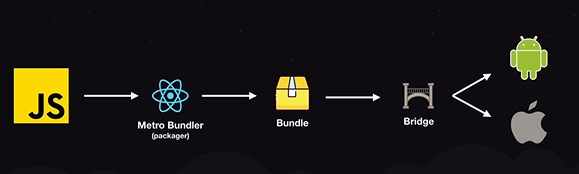
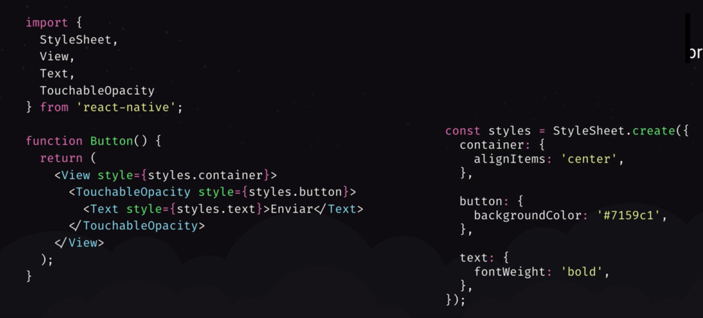

# Conceitos React Native

## O que é React Native?

- Versão do React para desenvolvimento mobile
- Multiplataforma (Android e IOS)
- Podemos manipular cada plataforma de forma diferente (Cada plataforma agir de uma forma)
- Interface nativa ou hibrida?
  - Diferente do Ionic que gera um webview e transforma em aplicativo, perdendo performance e fazendo uso de interface hibrida o React faz uso de interface nativa, ou seja, comunica-se direto com a API do Android e IOS (interface nativa)
- React Native injeta uma dependencia chamada 'Javascript core' que permite que o celular entenda JS nativamente
- Portanto o código não é transpilado
- Empresas estão migrando suas aplicações para React Native
  - Microsoft está fazendo uso de React Native em algumas aplicações mobile

## Arquitetura

- O código é escrito em JS com JSX
- Após este código passa por uma ferramenta chamada 'Metro Bundler' (Packager) que gerará um "bundle.js", comparando à web, podemos dizer que seria o webpack do mobile
- Este bundle passa por uma 'bridge' que é a ponte de comunicação entre o JS e o código nativo
- Após isto, o que for necessário, é transformado em código nativo (Java e Objective-C)


## Sintaxe

- Declaração dos componentes (functions e classes) são iguais ao HTML
- Não utilizamos HTML (como na web permitia), necessitamos fazer uso de componentes do próprio React ou criar os nossos próprios
- Aplicamos estilo sem classes ou ID's
- Todo o texto é com o componente `<Text />` e este não possui estilização própria, ou seja, sempre que criado requer uma estilização
- Nenhum elemento tem estilo
- As StyleSheet são criadas dentro do JS, porém mantém uma semelhança de sintaxe com CSS, mudando principalmente o uso de hífen para camelCase 
  - Ex: `background-color: 'blue'` => `backgroundColor: 'blue'` 
     
   

## Expo

- SDK com conjunto de funcionalidades prontas para utilizar (integrações, câmera, video, etc.)
- Não necessita emulador (contém aplicativo que facilita o desenvolvimento)

### Não vamos utilizar o Expo

- Caso necessário interagir e programar diretamente com código nativo, o Expo não permite
- Várias bibliotecas não tem suporte para o Expo
- O Expo liberou seu conjunto de ferramentas prontas para serem utilizadas com projetos que não utilizam Expo

## Configurando o Ambiente de Desenvolvimento (SDK)

- Vamos precisar instalar o SDK do Android e o XCode (só no MAC) para desenvolver para IOS
### Para IOS
- https://react-native.rocketseat.dev/ios/macos
### Para Android
- https://react-native.rocketseat.dev/android/linux/
- Instalando Java
  - ```bash
    sudo add-apt-repository ppa:openjdk-r/ppa
    sudo apt-get update
    sudo apt-get install openjdk-8-jdk
    
    #Testing - Need to be Java 8
    java -version
    #>>> openjdk version "1.8.0_252"
    ```
- Instalando Libs gráficas para conseguir emular o projeto
  - ```bash
    sudo apt-get install gcc-multilib lib32z1 lib32stdc++6
    ```
- Preparando para instalar AndroidStudio
  - Criar um caminho para instalação do AndroidStudio
    - ```bash
      mkdir -p ~/Android/sdk
      ```
  - Buscar o caminho do JDK 8, normalmente está dentro de `/usr/lib/jvm/java-8-openjdk-amd64`
    - ```bash
      ls /usr/lib/jvm/java-8-openjdk-amd64/
      ```
  - Adicionar no arquivo `~/.bashrc`
    - ```bash
      export JAVA_HOME=/usr/lib/jvm/java-8-openjdk-amd64/
      export ANDROID_HOME=~/Android/Sdk
      export PATH=$PATH:$ANDROID_HOME/emulator
      export PATH=$PATH:$ANDROID_HOME/tools
      export PATH=$PATH:$ANDROID_HOME/tools/bin
      export PATH=$PATH:$ANDROID_HOME/platform-tools
      ```
- Instalando AndroidStudio
  - Fazer download do Android Studio 
    - https://developer.android.com/studio/
  - Mover o arquivo compactado para `~/`
  - Extrair os arquivos
    - ```bash
      tar -xvzf android-studio-ide-193.6626763-linux.tar.gz
      ```
  - Adicionar ao `~/.bashrc`
    - ```bash
      export PATH=$PATH:~/android-studio/bin
      ```
    - Com isso conseguimos abrir o android studio executando apenas `studio.sh`
  - Executar `studio.sh`
  - Selecionar 'Do not import settings'
  - Aguardar carregar e na tela de Welcome clicar em 'Next'
  - Ao solicitar a localização do JDK escolher 'JAVA_HOME'
- Instalando a SDK 28 do Android (Pie)
  - Na Janela inicial do Android Studio clicar em 'Configure'
  - Clicar em 'SDK Manager'
  - Selecionar a SDK 28
  - Apply
  - Concordar e next
  - Aguardar Download
- Caso tenha suporte ao KVM (Informado durante a instalação do Android Studio)
  - ```bash
    sudo apt install qemu-kvm
    sudo adduser $USER kvm
    source ~/.bashrc

    #testando
    grep kvm /etc/group
    #Saida esperada
    #>>> kvm:x:NUMERO_QUALQUER:SEU_USUARIO
    ```
- Configurando Emulador
  - Na página inicial do AndroidStudio
  - Clicar em 'Configure'
  - Clicar em 'AVD Manager'
  - 'Create Virtual Device'
  - Selecionar um Device que possua Play Store
  - Configuar device

### Com WSL 

- No Windows
  - Instalar Android Studio
  - Configurar SDK
  - Configurar AVD
  - Configurar PATH até plataform-tools
    - Encontrar o caminho
      - `C:\Users\felip\AppData\Local\Android\Sdk\platform-tools`
    - Adicionar ao PATH (Através do CMD)
      - ```
        setx PATH "%PATH%;C:\Users\felip\AppData\Local\Android\Sdk\platform-tools"
        ```
  - Executar
    - ```
      adb kill-server
      adb -a nodaemon server start
      ```
- No Linux
  - Deve estar habilitado o uso de aplicativos [GUI via WSL](https://github.com/FelippeChemello/GoStack/blob/master/Anotacoes/Use%20GUI%20in%20WSL.md)
  - Instalar o AndroidStudio (Como no tutorial Anterior)
  - Configurar SDK
- No Windows
  - Iniciar um Device via AVD
- No Linux
  - Ao Executar 
    ```
    adb devices
    ```
  - Deve exibir o Device conectado

## Criando o Projeto

- Devemos iniciar o projeto executando o comando `npx react-native init <nome-do-projeto>`
  - Será criada uma pasta com a estrutura do projeto
- Dentro da pasta do Projeto
  - Há uma pasta chamada '__tests\__'
    - Nela deverá existir os testes do React Native
  - Uma pasta 'android'
    - Dentro deverá ser inserido o código nativo e configurações do android que serão utilizados pelo React Native para gerar a interface da aplicação
    - Será pouco utilizado, normalmente apenas permissões e configurações de deploy para loja de Apps
  - Uma pasta 'ios'
    - Dentro deverá ser inserido o código nativo e configurações do IOS que serão utilizados pelo React Native para gerar a interface da aplicação
    - Será pouco utilizado, normalmente apenas permissões e configurações de deploy para loja de Apps
  - node_modules
    - Pasta de módulos do node
  - Arquivos de configuração do próprio React Native
    - `.buckconfig`
    - `.flowconfig`
  - Configuração do git
    - `.gitattributes`
    - `.gitignore`
  - Arquivos de configuração da Guia de Estilos
    - `.eslintrc.js`
    - `.prettierrc.js`
  - Configuração de Live Reload da Aplicação
    - `.watchmanconfig`
  - Configuração do Babel, como visto no ReactJS, importando os presets
    - `babel.config.js`
  - `index.js`
    - Como se fosse o  `index.js` do ReactJS que faz o render dentro de da div#App do `public/index.html`
    - O `index.js` do React Native registra o componente dentro do aplicativo, dessa forma 'injetando' o nosso código 'App' dentro da aplicação
  - `App.js` 
    - Código da aplicação
  - Configuração do Metro Bundler (Mesma coisa do webpack do ReactJS)
    - `metro.config.js`
  - Gerenciador de pacotes
    - `package.json`

## Abrindo o projeto no emulador

- `npx react-native start`
- `npx react-native run-android`

### Com WSL

- `npx react-native start --host 127.0.0.1` 
- Verificar o nome do device com `adb devices`
- `npx react-native run-android --variant=debug --deviceId <nome-do-device|emulator-5554>`

## Componentes

- O componente `<View />` equivale a uma div do HTML
  - Componentes no React Native não possuem valores semanticos (significado), ou seja, diferente do HTML que fornece 'div', 'footer', 'header', 'main', 'aside' e 'section', tendo todos a mesma função de div. No React Native não existe essa distinção, sendo todos utilizados como `<View />`
- O componente `<Text> </Text>` serve para inserção de um elemento de texto
  - No HTML seria dividido em 'p', 'span', 'strong', 'h1', 'h2' e etc, porém no React Native é apenas `Text` e após aplica-se o estilo
- Nenhum componente possui estilação própria
- Todos os componentes são `display: flex`
- Não existe o conceito de herença como no HTML, ou seja, ao aplicar no Pai uma cor para o texto branca, tal cor não será aplicada ao texto. Para funcionar corretamente deve-se aplicar o estilo de cor diretamente ao elemento `<text> </text>`
- Componente `<StatusBar />` controla o estilo da status bar do dispositivo
  - Utiliza-se o atributo `barStyle` com o valor `light-content` ou `dark-content` para identificar se os icones exibidos deverão ser no estilo claro ou escuro
  - No android também pode-se utilizar o atributo `backgroundColor` que trocará por completo a cor da status bar.
  - Outro atributo disponivel apenas no android é `translucent` que permite que o conteúdo da aplicação vá para baixo da status bar
  - O componente `View` não disponibiliza um Scroll, assim sendo, caso o conteúdo ultrapassar o limite da tela, será perdido, para isso devemos utilizar o componente `ScrollView` que automaticamente insere um Scroll para ser possivel visualizar todo o conteúdo 

## Construindo Aplicação

- Instalaremos o 'Axios' para, como na Web, realizar as chamas para API
  - ```
      yarn add axios
    ```
- Configurando a URL (baseURL) para requisições 
  - No iOS com Emulador a baseURL deverá ser localhost
  - No iOS com Dispositivo físico deverá utilizar o IP da máquina (privado)
    - 192.168.0.x
  - Android com Emulador
    - Podemos utilizar localhost, porém necessita-se criar um proxy para conexão para isso basta executar no bash o seguinte comando que fará o encaminhamento da porta para dentro do emulador
      - ```bash
          #adb reverse tcp:<porta> tcp:<porta>
          abd reverse tcp:<porta> tcp:<porta>
        ```
    - Podemos utilizar o IP 10.0.2.2 que já conecta também com o emulador do android studio
    - Dispositivo físico deverá fazer uso do IP da máquina, como no iOS
  