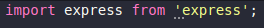

#Conceitos TypeScript

## O que é TypeScript?

- Linguagem totalmente baseada em JavaScript
- Adiciona Tipagem de código ao JS
- Permite acessar as funcionalidades mais recentes do JS, mesmo que não tenham sido adicionadas ao React ou Node
- Tem funcionamento semelhante ao BabelJS, convertendo códigos mais recentes para uma sintaxe mais antiga, dessa forma permitindo a execução até mesmo em ambientes mais antigos
  - TypeScript não é entendido puramente pelo Browser ou NodeJS, necessita ser convertido para JS puro
- TypeScript facilita o desenvolvimento

## Por que TypeScript?

- Com JavaScript puro não temos acesso facil para debuggar código, precisamos varrer o código para obter informações sobre os dados que estão sendo enviados e recebidos
- Com TypeScript conseguimos facilmente ter essas informações, tanto para visualização como para ferramentas de desenvolvimento como IntelliSense que consegue sugerir de forma mais fácil e correta o código

## Mitos e Verdades

- [Verdade/Mito] TypeScript diminui a produtividade
  - Inicialmente SIM, diminui a produtividade, pois:
    - Necessita de adaptação para durante o desenvolvimento inserir tipagem
    - Não permite a troca do tipo das variaveis
    - Cria algumas regras durante o período de desenvolvimento que antes não existiam
  - Porém ao passar do tempo a produtividade aumenta, pois:
    - Adiciona inteligencia durante para o editor
    - Facilidade para manutenção do código
- [Mito] TypeScript é transformar JavaScript em Java ou C#
  - TypeScript não é uma linguagem fortemente tipada, ou seja, não necessita de declaração de tipo em todas as variaveis 
  - TypeScript é uma linguagem fracamente tipada, ou seja, necessita de declaração de tipo apenas para variaveis que o editor não consegue reconhecer o tipo
    - Ao declarar uma variavel
        ```JavaScript
        const nome = 'Felippe' 
        ```
        O editor automaticamente reconhece que a variavel é do tipo String, neste caso não é necessário declarar o tipo
- [Mito] O mercado não utiliza TypeScript
  - No momento o mercado está virando para o TS justamente pelo aumento de produtividade e pela facilidade de manutenção/incremeto de código que ele traz
- [Mito] TypeScript substitui o JavaScript por completo
  - Por ser baseado sobre o JavaScript, caso ocorra alguma alteração siginificativa no JS, também será realizada a alteração no TS
  - O TypeScript 'apenas' adiciona mais funcionalidades à linguagem JavaScript
- [Mito/Verdade] TypeScript atrapalha quem é iniciante
  - Assim como a questão da produtividade, no inicio pode atrapalhar sim, porém com o passar do tempo passa a valer a pena pelo incremento de produtividade 
  - Também auxilia quem é iniciante por fornecer o IntelliSense

## Criando o Projeto

- Todo o projeto TypeScript necessita de, ao menos, uma dependencia de desenvolvimento que é o próprio TypeScript
    ```Bash
    yarn add typescript -D
    ```
  - Inserimos como dependencia de desenvolvimento, pois ao enviar para produção iremos converter para JS puro, portanto essa dependencia não necessita estar em produção
- Semelhante ao Babel, o TypeScript necessita de um arquivo de configuração chamado `tsconfig.json`, para criá-lo com as configurações padrões basta executar
    ```Bash
    yarn tsc --init
    ```
- Ao importar uma dependencia, como por exemplo `import express from 'express';` podemos perceber que uma indicação surgirá no inicio do nome do pacote.
 </img>
Isto indica que não foi encontrado o arquivo de declaração de tipos do modulo/pacote, para corrigir basta instalar o pacote que possui este arquivo de declaração, neste caso: 
    ```Bash
    yarn add @types/express -D
    ```
- Ao tentarmos executar `node index.js` irá apresentar erro, pois o NodeJS não entende arquivos TypeScript. A extensão `typescript` instala anteriormente fornece um binário chamado `tsc` que converte os arquivos TS em JS, basta executar
    ```Bash
    yarn tsc
    ``` 
- Após isto podemos executar o comando normalmente do NodeJS para executar a aplicação, informando o arquivo JS gerado
- Para melhor organização podemos utilizar uma configuração no arquivo `tsconfig.json` chamada `outDir` informando o caminho/pasta de destino dos arquivos convertidos.
  - Ao executar o comando a baixo os arquivos terão como saída este diretório
    ```Bash
    yarn tsc
    ```
  - Serão mantidos a estrutura de pastas que possuía originalmente
     </img>