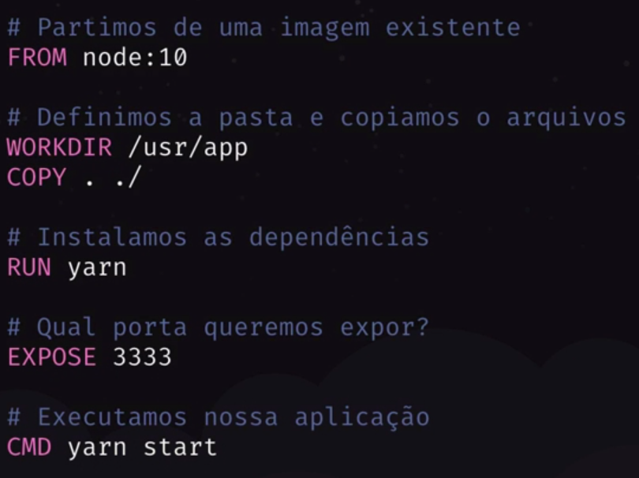

# Banco de Dados

## Formas de se Conectar ao Banco de Dados

- Utilizando diretamente o driver do banco de dados
  - Exemplo de PostGreSQL
    - https://node-postgres.com/
    - Com isso será necessário digitar todas as querys obtendo os resultados em vetores
- Utilizando um Query Builder
  - Exemplo Knex.js
    - http://knexjs.org/
    - Automatiza a criação das querys
- Utilizando um ORM (Object Relational Mapping)
  - Exemplo Sequilize (JS) e TypeORM (TS) (Utiliza o KnexJS por baixo)
  - Mapeia Registros do Banco de dados em objetos JS
  - Necessita que na Model da aplicação seja identificada como uma entidade do banco de dados e as colunas que fazem parte desta tabela
  - Sempre que a aplicação altera algum dado, este dado reflete diretamente no banco de dados
  - Facilita a troca entre banco de dados (PostgreSQL -> MySQL, MySQL -> SQLite)

## Docker

- Criação de ambiente isolados (containers)
- Containers expôe portas para comunicação
- Como instalar docker (Caminho para imagem `../Notion/Instalando Docker.png`)


### Conceitos

- Imagens (PostgreSQL, MongoDB, Node)
- Container
  - Instancia de uma Imagem
- Docker Registry (Docker Hub)
  - Local onde todas as imagens ficam armazenadas
- Dockerfile
  - Receita de uma Imagem
  - Com este arquivo podemos modificar uma imagem e personaliza-la
  - Exemplo de Dockerfile para rodar a aplicação Node em Docker
    

## Criando Docker PostgreSQL

- ```bash
    docker run --name <some-postgres> -e POSTGRES_PASSWORD=<mysecretpassword> -p <porta-da-maquina>:<porta-do-container> -d postgres

    docker run --name gostack_postgres -e POSTGRES_PASSWORD=docker -p 5432:5432 -d postgres
  ```

## Cliente Postgres

- DBeaver ou Postbird
- ```bash
  sudo snap install dbeaver-ce
  ```

## Configurando TypeORM

- ```bash
    yarn add typeorm pg
  ```
- Criar arquivo de configuração do TypeORM
    ```json
    {
        "type": "postgres",
        "host": "localhost",
        "port": 5432,
        "username": "postgres",
        "password": "docker",
        "database": "gostack_gobarber"
    }

    ```
