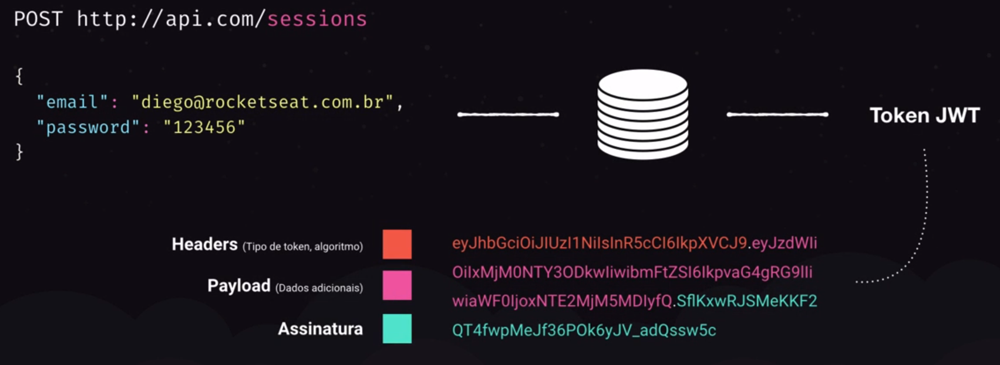

# Autenticação JWT (JSON Web Token)

## Como funciona

- Envia para uma rota `/sessions` uma requisição post com o usuário e senha para criar uma sessão
- Esta rota valida e verifica se as informações estão corretas
- Estando corretas, gera um Token JWT
    

## Criando o Token

- Iremos utilizar a dependencia `jsonwebtoken`
    ```bash
    yarn add jsonwebtoken
    yarn add -D @types/jsonwebtoken
    ```
- Para gerar um token utilizamos o método `sign()` passando no primeiro parametro os dados de payload, que serão criptografados, porém não são seguros, no segundo uma chave unica da aplicação (CHAVE SECRETA | FICA APENAS NO BACKEND) e no terceiro as configurações do token (devemos informar no minimo o `subject`, normalmente o Id do Usuário, ou seja, a quem aquele token pertence e o `expiresIn`, tempo para expirar o token)
    ```js
    sign({}, '7bfc04921ff6b3b5c5a319a5c9aba1e9', {
        subject: user.id,
        expiresIn: '1d',
    });
    ```

## Autenticando a rota

- Utilizaremos o método `verify()` do módulo `jsonwebtoken` para validar e decodar o token
  - Ele retornará o token decodado
  - No primeiro parametro devemos informar o `token` e no segundo a chave utilizada para cria-lo
- Nos dados decodados estarão disponiveis o *payload* do token
  - No caso da aplicação, até o momento mostrará:
    - `iat` = momento que foi criado o token
    - `exp` = momento em que o token deixará de ser válido
    - `sub` = subject (id do usuário) do token
